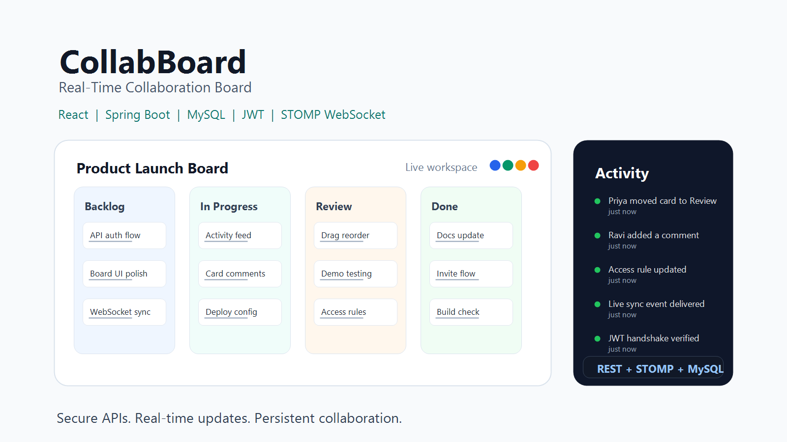

# CollabBoard

[](https://github.com/SURYAPRAKASH123671/collabboard/actions/workflows/ci.yml)



**CollabBoard** is a real-time Trello-style collaboration board built with **React**, **Spring Boot**, **MySQL**, **JWT authentication**, and **STOMP WebSockets**.

It is designed as a portfolio-grade full-stack Java project that demonstrates secure APIs, persistent collaboration data, authenticated real-time updates, and a polished React board experience.

<p>
  <a href="https://collabboard-silk.vercel.app/"><strong>Live Demo</strong></a>
  &nbsp;|&nbsp;
  <a href="https://github.com/SURYAPRAKASH123671/collabboard"><strong>GitHub Repository</strong></a>
</p>


> Note: the public Vercel deployment runs in frontend demo mode so visitors can open the board instantly. The full backend implementation is included and runs locally with Spring Boot, MySQL, JWT, and authenticated WebSockets.

## What It Does

CollabBoard provides a collaborative workspace where users can create boards, organize work into lists and cards, move tasks with drag-and-drop, add comments, view activity history, and see who is present on the board.

The project goes beyond basic CRUD by combining:

- REST APIs for authentication, boards, members, lists, cards, and comments
- Authenticated STOMP WebSocket commands for real-time board updates
- MySQL persistence through Spring Data JPA and Hibernate
- Optimistic React UI updates with server reconciliation
- Board-level access control for REST and WebSocket flows

## Feature Highlights

| Area | Details |
| --- | --- |
| Authentication | Signup, login, JWT access tokens, BCrypt password hashing |
| Authorization | Board membership, owner/member roles, invite-by-email access |
| Boards | Multiple boards, board switching, member-scoped visibility |
| Lists & Cards | Create, edit, delete, reorder, and move cards across lists |
| Real Time | STOMP over WebSocket for live card/list/comment/activity updates |
| Presence | Shows active board viewers through authenticated WebSocket sessions |
| Comments | Persisted card comments broadcast to connected board members |
| Activity Feed | Board event history for card, list, comment, and movement actions |
| Persistence | MySQL-backed users, boards, members, lists, cards, comments, events |
| Deployment | Docker setup, Vercel demo mode, backend deployment-ready config |

## Tech Stack

| Layer | Technology |
| --- | --- |
| Frontend | React, Vite, JavaScript, CSS |
| Backend | Java 17, Spring Boot, Spring MVC, Spring Security |
| Database | MySQL, Spring Data JPA, Hibernate |
| Realtime | STOMP over WebSocket, SockJS client |
| Auth | JWT, BCrypt |
| Testing | JUnit, Spring Boot Test, H2 test database |
| DevOps | Docker, Docker Compose, Vercel, Railway-ready backend config |

## Architecture

```text
React + Vite Client
  |-- REST: auth, boards, members, snapshots
  |-- STOMP WebSocket: commands, presence, live events
        |
Spring Boot API
  |-- AuthController
  |-- BoardRestController
  |-- BoardWebSocketController
  |-- Service layer
  |-- Spring Data JPA repositories
        |
MySQL
```

## Project Structure

```text
collabboard/
  backend/              Spring Boot REST + STOMP WebSocket API
  frontend/             React + Vite client
  docs/assets/          README and presentation assets
  docker-compose.yml    Local full-stack runtime
  .env.example          Environment variable checklist
```

## Run Locally

### Backend

```bash
cd backend
mvn spring-boot:run
```

The backend runs on:

```text
http://localhost:8081
```

### Frontend

```bash
cd frontend
npm install
npm run dev
```

The frontend expects:

```text
VITE_API_URL=http://localhost:8081
```

## Run With Docker

```bash
docker compose up --build
```

Local services:

```text
Frontend: http://localhost:5173
Backend:  http://localhost:8081
MySQL:    localhost:3307
```

Use `.env.example` as the environment checklist for database credentials, JWT secret, CORS origins, and ports.

## Verification

Backend tests:

```bash
cd backend
mvn test
```

Frontend build:

```bash
cd frontend
npm install
npm audit
npm run build
```

## API Overview

### Auth

```text
POST /api/auth/signup
POST /api/auth/login
GET  /api/auth/me
```

### Boards

```text
GET  /api/boards
POST /api/boards
GET  /api/boards/{boardId}
GET  /api/boards/{boardId}/members
POST /api/boards/{boardId}/members
```

### WebSocket

```text
/topic/boards/{boardId}
/app/boards/{boardId}/commands
/app/boards/{boardId}/presence/join
/app/boards/{boardId}/presence/leave
```

Supported command types:

```text
CREATE_LIST, UPDATE_LIST, DELETE_LIST, MOVE_LIST
CREATE_CARD, UPDATE_CARD, MOVE_CARD, DELETE_CARD
ADD_COMMENT
```

REST and WebSocket clients must send:

```http
Authorization: Bearer <token>
```

## Production Notes

The public demo currently uses:

```text
VITE_DEMO_MODE=true
```

This keeps the portfolio demo available without requiring a hosted backend. For a full production real-time deployment, host the Spring Boot API and MySQL, then set:

```text
VITE_DEMO_MODE=false
VITE_API_URL=https://<hosted-backend-domain>
```

Backend health check:

```text
/actuator/health
```

Required backend environment variables:

```text
COLLABBOARD_DB_URL=jdbc:mysql://<host>:<port>/<database>?useSSL=false&allowPublicKeyRetrieval=true&serverTimezone=UTC
COLLABBOARD_DB_USERNAME=<username>
COLLABBOARD_DB_PASSWORD=<password>
COLLABBOARD_JWT_SECRET=<64+ character random secret>
COLLABBOARD_DDL_AUTO=update
COLLABBOARD_ALLOWED_ORIGINS=https://collabboard-silk.vercel.app
```

## Engineering Decisions

- The backend derives the WebSocket actor from the authenticated principal instead of trusting client-sent names.
- Board data is member-scoped so users only see boards they own or have joined.
- WebSocket joins and commands validate board membership before returning or mutating board state.
- Presence is kept in memory because it represents active sessions, not long-term business data.
- The Vercel demo mode keeps the project reviewable while preserving a complete backend implementation.

## Portfolio Status

| Item | Status |
| --- | --- |
| GitHub repository | Public and maintained |
| Frontend demo | Live on Vercel |
| Backend implementation | Complete and tested locally |
| MySQL persistence | Implemented |
| WebSocket auth | Implemented |
| Production backend hosting | Deployment-ready, pending hosted backend |
